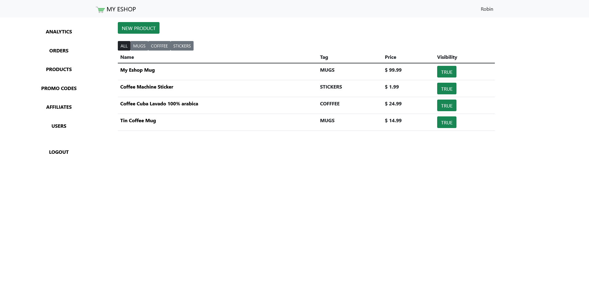

# **My Eshop**
* **Easy-to-use Open-Source E-Commerce solution**
* Based on **Python 3** & **Flask** & **MongoDB**


## Fuctions
* Easy to customize  
  * The whole eshop is configured from one json file  
* Order tracking page 
  * Client can see current status
* Admin analytics
* Support for multiple users
  * You can see who last dealt with the order
* Affiliate Links
* Promo Codes


# **How to run**
* Can be run **as is** or in a **Docker Container**
### **Requirements** 
  * MongoDB
  * Python 3 (Not required if gonna be run in Docker using image built from provided Dockerfile)

### **Eshop Configuration**
* Setup your eshop by going into **config.json** file and filling up details about your eshop

* Replace **"/static/images/cover.jpg"** with your own cover image (background on homepage) 
* Replace **"/static/documents/privacy-policy.pdf"** and **"/static/documents/terms-and-conditions.pdf"** with your own

  * When replacing files make sure to use same format as they are default 
    (e.g. **.jpg** needs to stay **.jpg**) 


## **Run**

* Install required Python libraries
  ```sh
  pip3 install -r requirements.txt
  ```


* Start the server
  ```sh
  gunicorn --bind 0.0.0.0.:"<port>" app:app
  ```
* Visit [`http://local-ip:port`]() in your browser

## **Docker**
* Built a Docker image with your customization
  ```sh
  docker build -t my_eshop .
  ```

* Run docker container
  ```sh
  docker run -it -p 8080:"<port>" --name my_eshop_container my_eshop
  ```

* Visit [`http://local-ip:port`]() in your browser


**Gunicorn only works on UNIX systems (Linux/Mac)** \
If you are trying to run this app on Windows, look for a different solution on \
how to run WSGI app (e.g. mod_wsgi) 

**For both of these options I would strongly recommend configuring a web server (e.g. NGINX or APACHE)**


## **After your Eshop is running**
Login page can be accessed on [`https://local-ip:port/login`]() \
The default username is **Admin** and password is **myeshop** 

* Go to [`https://local-ip:port/admin/users`]() in your browser
* Delete the **Admin** user
* Create a new user with your username and password
* Logout and log back in as the new user 


# **Eshop**

## Homepage


## Products Page


## Product Page


## Cart


# **Admin Panel**

## Analytics


## Orders


## Products



## Promo Codes


## Affiliate Links


## Users


made with ♥ by Robin Míček 